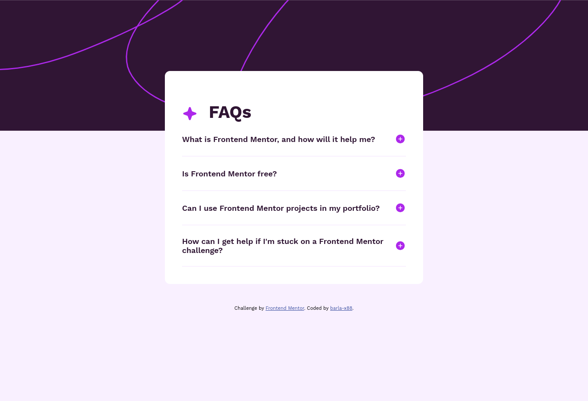

# Frontend Mentor - FAQ accordion solution

This is a solution to the [FAQ accordion challenge on Frontend Mentor](https://www.frontendmentor.io/challenges/faq-accordion-wyfFdeBwBz). Frontend Mentor challenges help you improve your coding skills by building realistic projects.

## Table of contents

- [Overview](#overview)
  - [The challenge](#the-challenge)
  - [Screenshot](#screenshot)
  - [Links](#links)
- [My process](#my-process)
  - [Built with](#built-with)
  - [Things I learned](#what-i-learned)
  - [Useful resources](#useful-resources)
- [Author](#author)

## Overview

### The challenge

Users should be able to:

- Hide/Show the answer to a question when the question is clicked
- Navigate the questions and hide/show answers using keyboard navigation alone
- View the optimal layout for the interface depending on their device's screen size
- See hover and focus states for all interactive elements on the page

### Screenshot

### Links

- Solution URL: [Github repo](https://barla-x88.github.io/FM-faq-accordion/)
- Live Site URL: [Live site URL](https://github.com/barla-x88/FM-faq-accordion)

## My process

### Built with

- HTML5
- CSS custom properties
- CSS media queries
- Vanilla JavaScript

### Things I learned

- using tabindex attribute on element to make it focusable
- best practices for using tabindex attribute
- finding currently focused element on web page
- about focusin and focusout events

### Useful resources

- [How do I find out which DOM element has the focus?](https://stackoverflow.com/questions/497094/how-do-i-find-out-which-dom-element-has-the-focus)

## Author

- Website - [Ankit Barla](https://barla-x88.github.io/portfolio/)
- Frontend Mentor - [@barla-x88](https://www.frontendmentor.io/profile/barla-x88)
- Twitter - [@BarlaX88](https://twitter.com/BarlaX88)
